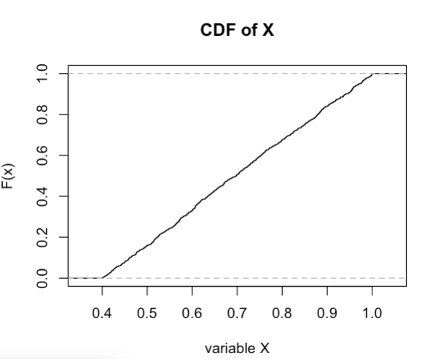
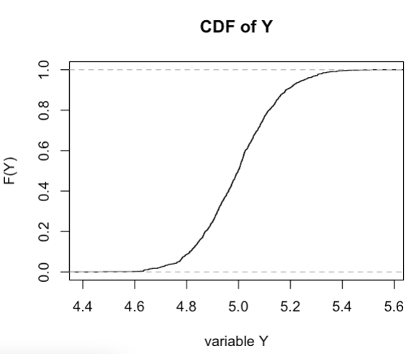
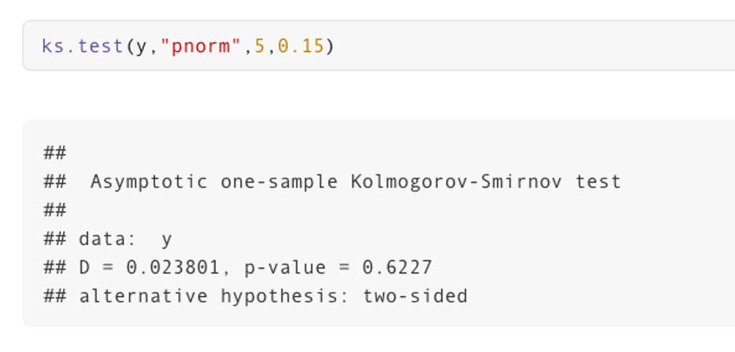
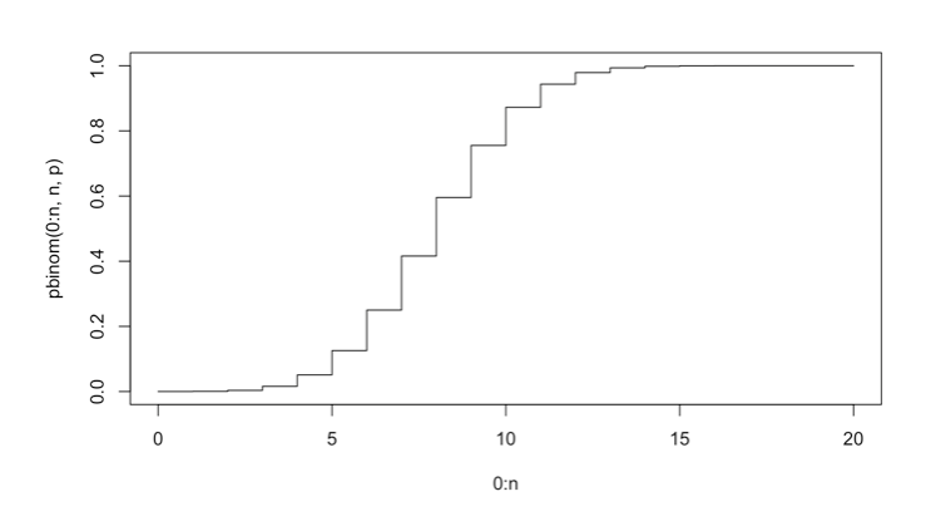
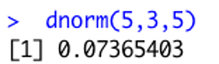

## Problem 1: Which of the following statements are true?

An Instagram study has determined that IF a user has a tag in their story, 12% of the time the user tags a friend and 35% of the time the user tags a geographical location.

A.	The probability that a person with 560 tagged stories in their story feed, has tagged a friend in 65 or more of these stories is `0.63`.

```{r}
# sum up probabilities from [65, 560]
1 - pbinom(q = 64, size = 560, prob = 0.12)

# sum up probabilities from [65, 560]
sum(dbinom(x = 65:560, size = 560, prob = 0.12))
```

<span style="color:#ff0000;">**ANSWER**: TRUE</span> (The probability is `0.63`.)

<br>

B.	The probability that a person with 560 tagged stories in their story feed, has tagged a place in 65 or less of these stories is `0.41`.

```{r}
# sum up probabilities from [65, 560]
pbinom(q = 65, size = 560, prob = 0.35)

# sum up probabilities from [65, 560]
sum(dbinom(x = 0:65, size = 560, prob = 0.35))
```

<span style="color:#ff0000;">**ANSWER**: FALSE</span> (The probability is `8.202e-37`, not `0.41`.)

<br>

C.	Since the sample size is large we can find the probability in part A with a Normal approximation where the variable can be approximated with mean  and standard deviation.

```{r}
# mu = np, sd = sqrt(npq)
mu <- 560 * 0.12
sd <- sqrt(560 * 0.12 * 0.88)

pnorm(q = 65, mean = mu, sd = sd, lower.tail = FALSE)
```

<span style="color:#ff0000;">**ANSWER**: TRUE</span> (The probability can be roughly approximated.)

<br>

D.	Since the success probability is low, we cannot find the probability in part A with a Normal approximation.

```{r}
# mu = np, sd = sqrt(npq)
mu <- 560 * 0.12
sd <- sqrt(560 * 0.12 * 0.88)

pnorm(q = 65, mean = mu, sd = sd, lower.tail = FALSE)
```

<span style="color:#ff0000;">**ANSWER**: FALSE</span> (The probability can still be roughly approximated.)

## Problem 2: Which of the following statements are true?

Assume in a University Graduate program, on average five students drop below a grade of 80% (identified as “struggling students”) in every semester. A typical semester contains 14 weeks. Assume that this program has 125 students. We want to find the probability that there will be no more than two struggling students in seven weeks.

A.	We can assume that identifying a struggling student is a Bernoulli trial with success probability `p = 5/14`.

<span style="color:#ff0000;">**ANSWER**: FALSE</span> (If we used Bernoulli, we'd probably use `p = 5/125`? What if 20 students failed? We wouldn't use `p = 20/14`...)

<br>

B.	If the trials are independent, then `X = number of struggling students in a week` is modeled by a Binomial distribution with `n = 125` and `p = 5/14`.

<span style="color:#ff0000;">**ANSWER**: FALSE</span> (Similar reasoning as above - if 20 students failed, we wouldn't use `p = 20/14`...)

<br>

C.	The probability that there will be no more than two struggling students in seven weeks is `0.544`.

```{r}
# x = number of struggling students, lambda = average number of students struggling in 7 weeks: 5/14 * 7
ppois(q = 2, lambda = 5/14 * 7)

sum(dpois(x = 0:2, lambda = 5/14 * 7))
```

<span style="color:#ff0000;">**ANSWER**: TRUE</span> (The probability is `0.544`.)

<br>

D.	Since `n` is large and `p` is small, we can approximate this with a poisson distribution where lambda is `np = 44.64`.

<span style="color:#ff0000;">**ANSWER**: FALSE</span> (I just don't think this is a technique to use... Binomial can be approximated by Poisson, but we already have a Poisson, not a Binomial.)


## Problem 3: Which of the following statements are true ?

A.	An empirical cumulative distribution function (CDF) is a non-parametric estimator of the underlying CDF of a random variable and ECDF (Empirical CDF) can be used to confirm a distribution of a variable.

<span style="color:#ff0000;">**ANSWER**: TRUE</span> (The statement is true.)

<br>

B.	According to the following ECDF plot, the `X` variable is uniformly distributed from `X ~ Uniform(0.4, 1)` and the `Y` variable has a continuous distribution.

{width=45%}
{width=45%}

<span style="color:#ff0000;">**ANSWER**: TRUE</span> (The statement is true.)

<br>

C.	From the following results of the K-S Test it can be seen that the `y` variable has a Normal distribution with mean `5` and standard deviation `0.15`.



<span style="color:#ff0000;">**ANSWER**: TRUE</span> (The null hypothesis of the K-S Test is that `y` was drawn from the distribution described, and we fail to reject the null hypothesis.)

D.	By looking at the following CDF plot it can be seen that  `P(X < 8)` is `0.60`.



<span style="color:#ff0000;">**ANSWER**: FALSE</span> (`P(X < 8) = 0.40` [note that `X` is strictly less than `8`]. `P(X <= 8) = 0.60`.)


## Problem 4: Which of the following statements are true?

Spotify’s API gives you the ability to extract several audio features of a song. The available features that also have been used for this analysis are: https://medium.com/@boplantinga/what-do-spotifys-audio-features-tell-us-about-this-year-s-eurovision-song-contest-66ad188e112a.

The first step was registering my application in the API Website(https://developer.spotify.com/documentat ion/web-api/) and getting the keys (Client ID and Client Secret) for future requests. The Spotify Web API has different URIs (Uniform Resource Identifiers) to access playlists, artists, or tracks information.

Using this Spotify API, we can get audio features of songs for different musicians. Assume that there are only 400 musicians belonging to the high "Danceability" category (danceability describes how suitable a track is for dancing based on a combination of musical elements including tempo, rhythm stability, beat strength, and overall regularity. A value of 0.0 is least danceable and 1.0 is most danceable). 132 of these musicians are pop music artists and the rest are rock music artists.

A. If I randomly extracted 20 songs that belong to this Danceability category, the probability that more than 10 of them will belong to Rock music artists is `0.919`.

```{r}
1 - phyper(q = 10, m = 268, n = 132, k = 20)

sum(dhyper(11:20, m = 268, n = 132, k = 20))
```

<span style="color:#ff0000;">**ANSWER**: TRUE</span> (The probability is `0.919`.)

<br>

B.If I randomly extracted 20 songs that belong to this Danceability category, the probability that more than 10 of them will belong to Pop music artists is `0.968`.

```{r}
1 - phyper(q = 10, m = 132, n = 268, k = 20)

sum(dhyper(11:20, m = 132, n = 268, k = 20))
```

<span style="color:#ff0000;">**ANSWER**: FALSE</span> (The probability is `0.03141`, not `0.968`.)

<br>

C. Now imagine I am randomly picking balls - without replacement - from an urn containing 132 red balls and 268 blue balls. The probability of choosing exactly 15 red balls out of the 40 balls I picked will be `0.112`.

```{r}
dhyper(x = 15, m = 132, n = 268, k = 40)
```

<span style="color:#ff0000;">**ANSWER**: TRUE</span> (The probability is `0.112`.)

<br>

D. Now imagine I am randomly picking balls - with replacement - from an urn containing 132 red balls and 268 blue balls. The probability of choosing exactly 15 red balls out of the 40 balls I picked will be `0.891`.

```{r}
# 40 choose 15 * (132 / 400)^15 * (268 / 400)^25
x = choose(40, 15)
x * (132 / 400)^15 * (268 / 400)^25

dbinom(x = 15, size = 40, prob = 132 / 400)
```

<span style="color:#ff0000;">**ANSWER**: FALSE</span> (The probability is `0.108`, not `0.891`.)


## Problem 5. Which of the following statements are true?

A common daily lottery game involves the drawing of three digits from 0 to 9 independently with replacement and independently from day to day.  Lottery watchers often get excited when all three digits are the same, an event called triples.

A.	If `X` is the number of days without triples before the first triple is observed, then `X` has a geometric distribution with `p (the probability of obtaining triples) = 10/1000`.

<span style="color:#ff0000;">**ANSWER**: TRUE</span> (The distribution is the correct choice, and the probability of obtaining triples is `10/10 * 1/10 * 1/10 = 10/1000`.)

<br>

B.	The probability that there were more than 10 days without triples before the first triple is observed is `0.904`.

```{r}
1 - pgeom(q = 10, prob = 10/1000)

1 - sum(dgeom(0:10, prob = 10/1000))
```

<span style="color:#ff0000;">**ANSWER**: FALSE</span> (The probability is `0.895`, not `0.904`.)

<br>

C.	The probability that there were 100 days until observing 4 triples is `0.038`.

```{r}
dnbinom(x = 96, size = 4, prob = 10/1000)

# any configuration of 3 successes in the first 99 days, with the 100th day required to be a success
# configuration includes 4 success (p = 10/1000) and 96 failures (990/1000)
choose(99, 3) * (10/1000)^4 * (990/1000)^96
```

<span style="color:#ff0000;">**ANSWER**: FALSE</span> (The probability is `0.000598`, not `0.038`.)

<br>

D.	In summary, in a Binomial distribution we are looking at the number of successes; in a Geometric distribution we are looking at the number of failures until a success; and in a Negative Binomial distribution we are looking at number of failures until r successes.

<span style="color:#ff0000;">**ANSWER**: TRUE</span> (The statement is true.)


## Problem 6. Which of the following statements are true?

Consider DSAN students arriving at the restaurant Tombs in Georgetown, DC. Since the  students have different schedules there’s a possibility of students going to this restaurant all day long for meals.

A.	If 5 students arrive every 2 hours, then the number of DSAN students arriving at the restaurant is a Poisson process with the rate parameter lambda is 2.5.

<span style="color:#ff0000;">**ANSWER**: FALSE</span> (Sort of a trick question - we need to consider units.)

<br>

B.	If 5 students arrive every 2 hours, then the probability that the time is less than 30 minutes until the next student arrives at the restaurant is `0.713`.

```{r}
pexp(q = 30, rate = 5 / 120)
```

<span style="color:#ff0000;">**ANSWER**: TRUE</span> (The probability is `0.713`.)

<br>

C.	The homogeneous Poisson process is based on a constant rate of events and, in contrast to the homogeneous Poisson process, the intensity function (rate function) of an inhomogeneous Poisson process is a nonconstant function.

<span style="color:#ff0000;">**ANSWER**: TRUE</span> (The statement is true.)

<br>

D.	The exponential distribution is memoryless because it has the same distribution regardless of how much time has already elapsed if you haven’t observed anything during that time period.

<span style="color:#ff0000;">**ANSWER**: TRUE</span> (The statement is true.)


## Problem 7. Which of the following statements are true?

A.	Summation of independent random uniform variables has a Uniform distribution.

```{r fig.width = 10}
x <- runif(n = 10000, min = 0, max = 5)
y <- runif(n = 10000, min = 0, max = 5)
z <- x + y
par(mfrow = c(1, 3))
hist(x)
hist(y)
hist(z)
```

<span style="color:#ff0000;">**ANSWER**: FALSE</span> (The statement is false. The example above expresses this.)

<br>

B.	Summation of independent random Normal variables has a Normal distribution.

```{r fig.width = 10}
x <- rnorm(n = 10000, mean = 0, sd = 5)
y <- rnorm(n = 10000, mean = 0, sd = 5)
z <- x + y
par(mfrow = c(1, 3))
hist(x)
hist(y)
hist(z)
```

<span style="color:#ff0000;">**ANSWER**: TRUE</span> (The statement is true. The example above expresses this.)

<br>

C.	If `X` has a Standard Normal distribution, the square of `X` has a Chi-Square distribution with `m` degrees of freedom.

<span style="color:#ff0000;">**ANSWER**: FALSE</span> (The number of degrees of freedom, `df`, is 1.)

<br>

D.	The exponential distribution and the Chi-Square distribution are coming from the Gamma distribution.

<span style="color:#ff0000;">**ANSWER**: TRUE</span> (The statement is true. The Exponential distribution is a special case of the Gamma distribution where `alpha = 1`. The Chi-Square distribution is a special case where `alpha = k/2` and `beta = 1/2`.)


## Problem 8. In each of the following examples, try to indicate whether the Poisson process would be a good model.

A. Number of days until a hurricane in Florida.

<span style="color:#ff0000;">**ANSWER**: FALSE</span> (The number of days until an event occurs is better-suited for an Exponential distribution.)

<br>

B. Number of times a chicken lays its eggs in a given day.

<span style="color:#ff0000;">**ANSWER**: TRUE</span> (This works because the rate can be described as the number of eggs per day [amount per time].)

<br>

C. Number of trains arriving at Rosslyn metro station.

<span style="color:#ff0000;">**ANSWER**: FALSE</span> (Sort of a trick question - this is not a random process but rather a predictable one.)

<br>

D. Number of DSAN students winning the second year scholarship each year.

<span style="color:#ff0000;">**ANSWER**: TRUE</span> (This works because the rate can be described as the number of students per year [amount per time].)


## Problem 9. Which of the following statements are true?

A.	 `X` is Normally distributed with mean `3` and standard deviation `5`. According to the following output the probability of `X` being equal to `5` is `0.0736`.



<span style="color:#ff0000;">**ANSWER**: FALSE</span> (`dnorm()` gives the density for continuous functions, not the probability. `P(X = 5) = 0`)

<br>

B.	Assume that a team researches the age of people in a city who watch the TV series "The Crown" on Netflix. It is found that the age follows a Normal distribution with mean `43` and variance `471`. The probability that this TV series is watched by adults between 40 years to 60 years old is `0.338`.

```{r}
pnorm(q = 60, mean = 43, sd = sqrt(471)) - pnorm(q = 40, mean = 43, sd = sqrt(471))
```

<span style="color:#ff0000;">**ANSWER**: TRUE</span> (The probability is `0.338`.)

<br>

C.	If the above experiment has expanded to other cities, then assume that the age became harder to explain by the Normal distribution. Still, it had a symmetric distribution with heavier tails. In this case we may be able to model the age by a t-distribution.

<span style="color:#ff0000;">**ANSWER**: TRUE</span> (The statement is true.)

<br>

D.	On average, I can work on my laptop for 24 hours (if not used for intense computational tasks) before the battery dies. If I forget to bring my charger to campus, the probability that I will be able to use the laptop in my 2 and a half hours class without the battery dying (in the class I will be only using the laptop for teaching purposes) is 90%.

```{r}
# exponential distribution with rate = 1 battery life per 24 hours
1 - pexp(q = 2.5, rate = 1/24)
```

<span style="color:#ff0000;">**ANSWER**: TRUE</span> (The probability is `0.90`.)


## Problem 10. Which of the following statements are true?

A.	For continuous variables with a continuous probability distribution, the likelihood and the probability density function values at a given point are not the same.

<span style="color:#ff0000;">**ANSWER**: FALSE</span> (The two values *are* the same.)

<br>

B.	For a discrete variable with a discrete probability distribution, the exact probabilities are found by the probability mass function.

<span style="color:#ff0000;">**ANSWER**: TRUE</span> (The statement is true.)

<br>

C.	For continuous variables with a continuous probability distribution, the probabilities are found by integrating the probability density function.

<span style="color:#ff0000;">**ANSWER**: TRUE</span> (The statement is true.)

<br>

D.	For continuous variables with a continuous probability distribution, the probability density function can always be found by differentiating the cumulative density function (CDF).

<span style="color:#ff0000;">**ANSWER**: FALSE</span> (Trick question - we cannot find it if the CDF is not differentiable.)

